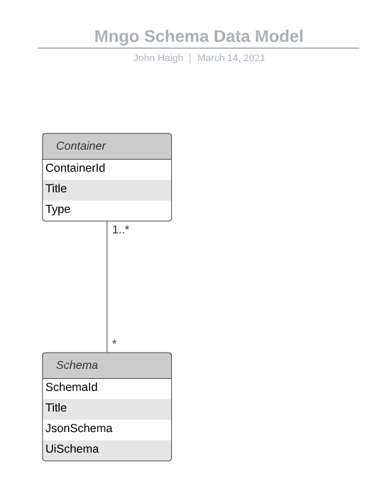

# Status
Pending/RFC

# Context

* Support a parent container that can have one to many child json schema's
* Support one to many json schema

# Goals
The goal of the Data Model ADR is to define the data model design for Application Builder Service. This ADR will define the data model entities and therefore the database tables that will participate to create the Application Builder Data store.

* A data model that is performant
* A data model that is dynamic and supports n levels of hierarchy with parent/child relationships amongst jsonschema
* A data model that supports paging data. Example. A parent entity (page) can have one to many child json schemas in a page.

# Considerations

A single container can have unlimited child schema entities (one container to many schema) that is loaded via paging or infinite scrolling or object loading. The frontend page should load a business maximum of jsonschema's and then prompt the user either via scroll or paged numbers to load the additional json schema items that will then be fetched from the server.

# Proposed Design

* An entity called container that will be a container (i.e. application) and parent entity that has fields: Title, Type, ContainerId
* An entity called schema that will be the main vehicle for the json schema. Schema will be a child item to container that has fields: SchemaId, Title, Type, Jsonschema, Uischema, ContainerId. Schema has parent reference via the ContainerId column.

# Implications & Additional Changes

* There can be many schema entities for a single container
* The backend service should allow for paging or pagination of schema's
